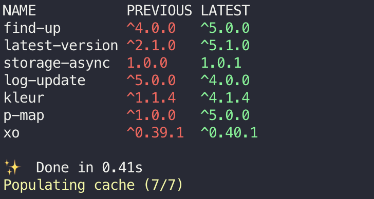

# odc 📦

> Easily update your npm dependencies to their latest versions.

[](https://travis-ci.org/xxczaki/odc) 
[](https://github.com/xojs/xo)



## Highlights

- ⚡ Blazing Fast (usually completes in less than a second)
- ⚙️ Simple, but configurable
- ✂️ Lightweight (~150 LOC & 6 dependencies)

## Install

```
$ npm install --global odc
```

## Usage

```
Usage: 
  $ odc <options>
Options:
  -i, --input <path>                 Path of a package.json file (defaults to the nearest one)
  -e, --exclude <pkg,...>            Exclude packages
  -j, --json                         Output a JSON object, instead of writing package.json
  -v, --version                      Print the version
  -h, --help                         Print this help
Examples:
  $ odc
  $ odc --input test/ -e chalk,lodash
```

### License

MIT
